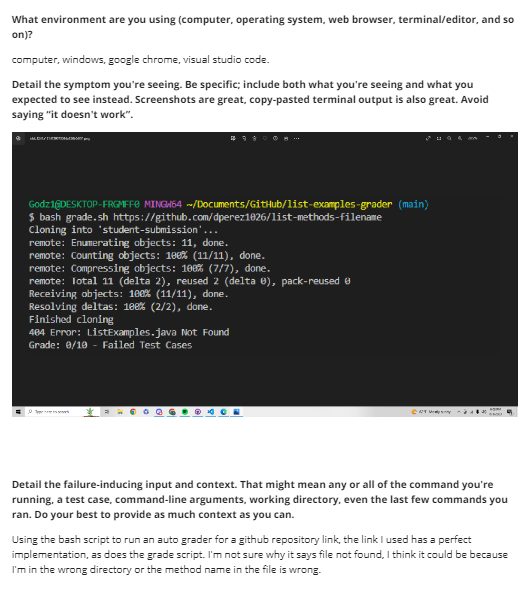
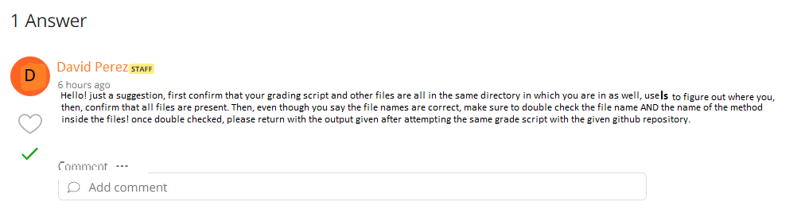
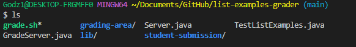
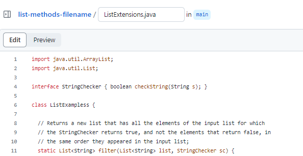
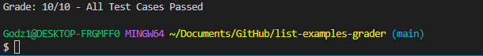

# Part 1  

  
  

>**STUDENT**: After trying the `ls` command, I confirmed I was in the correct directory.  
>  
>But after double checking my files like you said, I found out that I actually had the correct `method` name, but incorrect `file` name so this might be why it wasn't being found!  
>  
>After changinge the name of the file, I ran the same command as before, to which the tests now passed.  
>  
>It seems that the bug I had faced was not related to the directory, but was rooted inside my file name within the github repository being graded by my script. Although the method name was correct, the file name was incorrect and since my grading script searches for a specific file name, it showed an error becuase it was named incorrectly before I changed it. 

