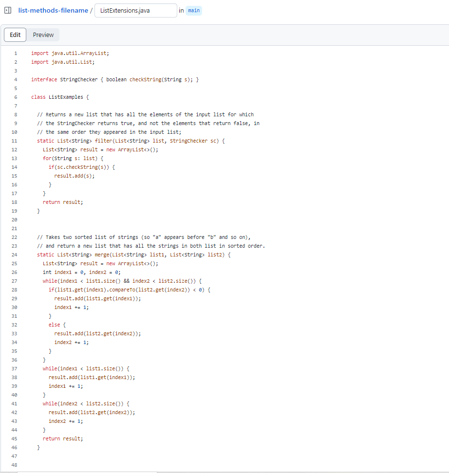
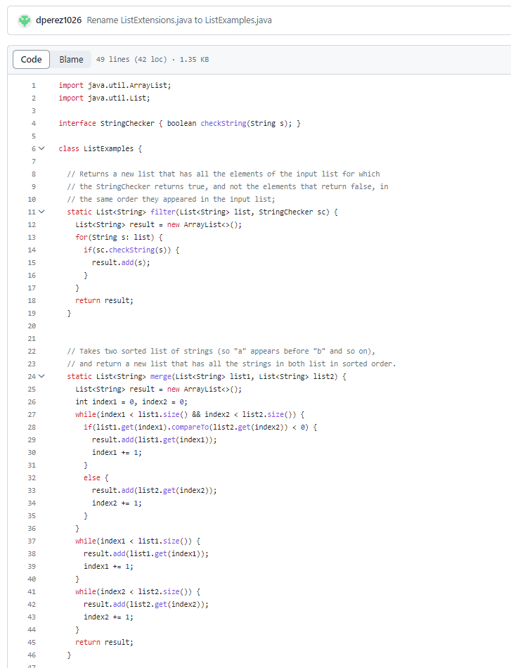

# Part 1  

  
  

>**STUDENT**: After trying the `ls` command, I confirmed I was in the correct directory.  
>  
>But after double checking my files like you said, I found out that I actually had the correct `method` name, but incorrect `file` name so this might be why it wasn't being found!  
>  
>After changinge the name of the file, I ran the same command as before, to which the tests now passed.  
>  
>It seems that the bug I had faced was not related to the directory, but was rooted inside my file name within the github repository being graded by my script. Although the method name was correct, the file name was incorrect and since my grading script searches for a specific file name, it showed an error becuase it was named incorrectly before I changed it.  

  
**SETUP**:  Download visual studio code: https://code.visualstudio.com/download ,  
Github repository for setup on visual studio code: https://github.com/ucsd-cse15l-s23/list-examples-grader  
Github repository for submission being graded by the grading script: https://github.com/dperez1026/list-methods-filename  
Make sure you are in a `GitHub Bash` terminal, then make sure you're in the directory  `~/Documents/GitHub/list-examples-grader`.  
The contents of the file containing the bug before being fixed are:  
  
The contents after the file containing the bug is fixed:  
  
Command used to cause the bug: `bash grade.sh https://github.com/dperez1026/list-methods-filename`  
All that must be done to the file, is the change the name of the file through editing on the GithugPages website: https://pages.github.com/  
to the correct file name that matches what the grading script is searching for when submitting the github repository link as a submission in the command line.  
# Part 2  
One thing I learned from the second half of the quarter is how useful making a bash script is when dealing with certain files. In the example used in this lab, it was very useful to compile and run files with arguments that are different every time by only using one command in the command line, instead of repeating multiple commands over and over again individually. I'll for sure be using bash scripts in the future to make it easier to run JUnit tests and other kinds of files that might require multiple sets of commands for different types of arguments given. 

